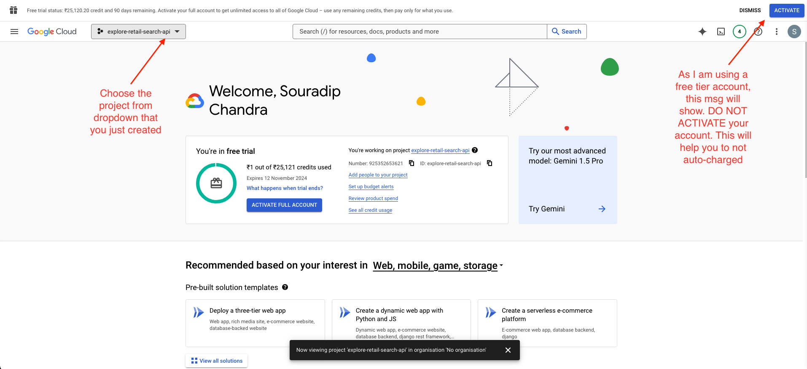
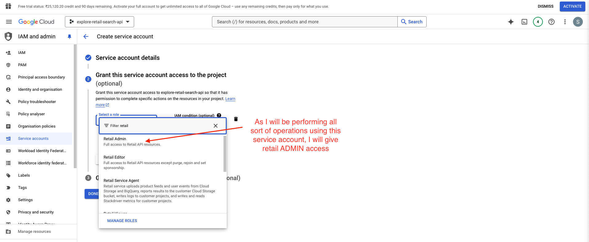
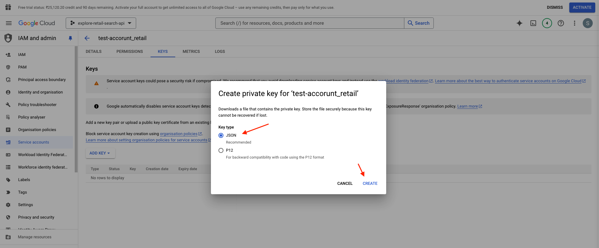
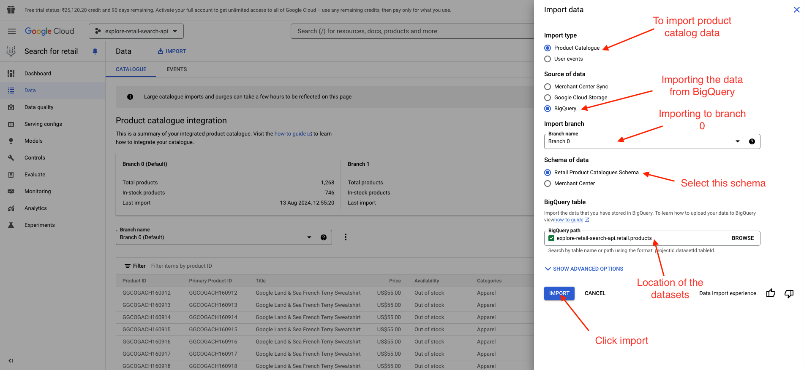
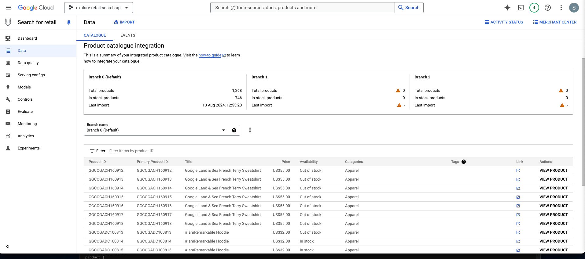
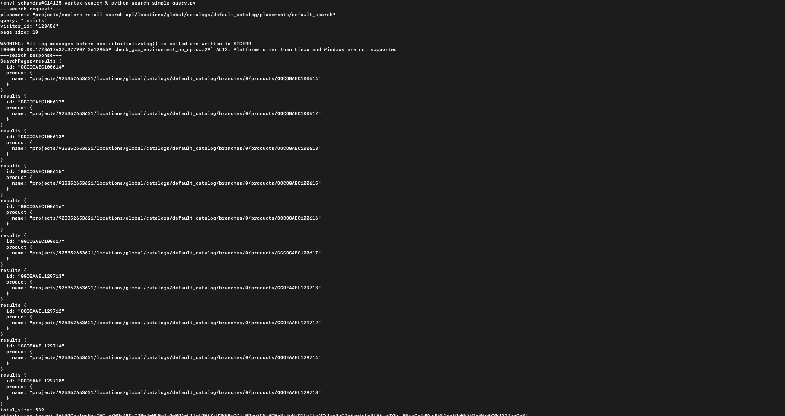

# Retail API Authentication and Usage Guide

The official documentation for the Retail API can be found [here](https://cloud.google.com/generative-ai-app-builder/docs/apis).

## Steps to Follow

### 1. Authenticate to Vertex AI Agent Builder

To access various services and APIs, authentication is required. Google Cloud offers multiple ways to authenticate, which are detailed [here](https://cloud.google.com/docs/authentication).

For this guide, I will use the Service Account option for authentication. However, you can choose any method that suits your needs. (Detailed steps for service account authentication will be discussed later.)

### 2. Use Vertex AI Agent Builder

There are three main options available:

- **Client Libraries (Recommended by Google):**

  - These libraries simplify access to Google Cloud APIs from supported languages, significantly reducing the amount of code you need to write.
  - Supported languages as of August 14, 2024, include C#, Go, Java, Node.js, PHP, Python, and Ruby.
  - Learn more about client libraries [here](https://cloud.google.com/generative-ai-app-builder/docs/libraries).

- **REST API Reference:**

  - Similar to client libraries, REST APIs allow direct access to Google Cloud services. While you can make raw requests to the server, client libraries are preferred for their ease of use.
  - More information can be found [here](https://cloud.google.com/generative-ai-app-builder/docs/reference/rest).

- **RPC API Reference:**
  - Use this option to create RPC client stubs.
  - Learn more about RPC API [here](https://cloud.google.com/generative-ai-app-builder/docs/reference/rpc).

> **Note:** These steps are applicable not just for Retail search but also for accessing other Google services like Vision API, BigQuery, and many more.

Next, I will break down each step and provide a simple Python script to call the Retail Search API endpoints.

## Step-by-Step Guide

### Login using a Free Account, Create a Project, and Enable Required APIs

1. **Create a Project:**

   - First, you'll need to create a project. Follow the steps provided [here](https://developers.google.com/workspace/guides/create-project).

   

2. **Enable APIs for Retail Search:**
   - After creating the project, you'll need to enable the APIs required for your use case. This is a standard procedure for accessing various Google services.
   - To enable the Search for Retail API:
     1. Navigate to the [Search for Retail API](https://console.cloud.google.com/ai/retail).
     2. Click **Turn On API**.
     3. Click **Continue** and accept the data terms by clicking **Accept**.
     4. Click **Turn On** to enable search & browse features (optional).
     5. Finally, click **Get Started**.

### Steps to Create a Service Account and Get the API Keys

1. **Navigate to IAM and Admin:**

   - Go to the Google Cloud Console and navigate to the **IAM & Admin** section.

2. **Create a Service Account:**

   - Click on **Service Accounts**.
   - Then click on **Create Service Account**.

3. **Provide Service Account Details:**

   - Enter a name for your service account.
   - Click on **Create and Continue**.

4. **Grant Access to the Service Account:**
   - In the **Grant this service account access to the project** tab, select the appropriate role for the service account.
   - **Important:** Ensure you select the correct role; otherwise, you might encounter an **Access Forbidden** error.
   - For comprehensive retail operations, I will assign **Full Admin Access** to this service account.



5. **Generate API Keys:**
   - Click on the newly created service account and then go to the **KEYS** tab.
   - Next, click on **ADD KEYS** → **Create new Key**.



- Keep the key type as **JSON** and then click on **Create**. A JSON file will automatically be downloaded. This file contains all the information needed to authenticate your backend servers, which we will use later.

### Ingested the Data into Retail API

For this section, I have already stored data in BigQuery and Cloud Storage using predefined data files, which are also attached to this project:

1. **Product Catalog Data:**

   - I used `catalog_data.json`, which follows the schema outlined in `SCHEMA.json`. You can use any product data, but it must match the schema that the Retail API can ingest.
   - For more details on the required schema, refer to the [Retail API documentation](https://cloud.google.com/retail/docs/catalog).

   

2. **User Events Data:**

   - I used `recent_retail_events.json` and imported it using a similar approach through Cloud Storage.

   

> **Note:** You can use any product data, but it must adhere to the schema format expected by the Retail API. The data ingestion process is part of the ETL (Extract, Transform, Load) process and is not covered here. For this project, you can use the sample product data and user events data provided, which is attached within the project files.

Once you successfully import the data, you can view it in the data tab as shown below:



---

### Setup Backend Service to Call Google APIs

Now that we have the data in the Retail Search API and the API keys for authentication, we can focus on setting up the backend server.

#### 1. Install Google Cloud Retail Libraries

To call Google APIs, we will use the Python-based client library. Follow these steps to set up your environment and install the necessary packages:

1. **Create an Isolated Python Environment:**

   Run the following commands in a terminal to create a virtual environment:

   ```bash
   virtualenv -p python3 myenv
   source myenv/bin/activate
   ```

2. **Install Google Packages:**

   Next, install the required Google Cloud packages by running:

   ```bash
   pip install google
   pip install google-cloud-retail
   ```

This will set up your Python environment to interact with the Google Cloud Retail API using the provided client libraries.

### Implementing a Simple Search Query to Retrieve Data from the Retail API

To demonstrate how to fetch data from the Retail API endpoints, I've created a simple function called `search_simple_query`. Here's a breakdown of the steps and the code used:

1. **Setting Up Environment Variables:**

   The first line of the code sets up the `GOOGLE_APPLICATION_CREDENTIALS` environment variable to point to the API keys downloaded and saved earlier.

2. **Importing Required Libraries:**

   We import the necessary components from the client libraries to make the request:

   ```python
   from google.cloud.retail import SearchRequest, SearchServiceClient
   ```

3. **Setting Up Project ID:**

   Set your project ID, which can be retrieved from the downloaded API key JSON file:

   ```python
   project_id = "explore-retail-search-api"
   ```

4. **Defining the Search Request:**

   The `get_search_request` function constructs the search request using the project ID, query string, and other required parameters:

   ```python
   def get_search_request(query: str):
       default_search_placement = (
           "projects/"
           + project_id
           + "/locations/global/catalogs/default_catalog/placements/default_search"
       )

       search_request = SearchRequest()
       search_request.placement = default_search_placement  # the Serving Config name.
       search_request.query = query
       search_request.visitor_id = "123456"  # A unique identifier to track visitors
       search_request.page_size = 10

       print("---search request:---")
       print(search_request)

       return search_request
   ```

   > For the required parameters, please refer to the following official documentation: [SearchServiceClient](https://cloud.google.com/python/docs/reference/retail/latest/google.cloud.retail_v2alpha.services.search_service.SearchServiceClient).

5. **Calling the Retail Search API:**

   The `search` function executes the search query and prints the response. Adjust the `query_phrase` to test different search terms:

   ```python
   def search():
       # TRY DIFFERENT QUERY PHRASES HERE:
       query_phrase = "tshirts"

       search_request = get_search_request(query_phrase)
       search_response = SearchServiceClient().search(search_request)

       print("---search response---")
       if not search_response.results:
           print("The search operation returned no matching results.")
       else:
           print(search_response)
       return search_response

   search()
   ```

6. **Using `SearchServiceClient`:**

   `SearchServiceClient` is a method provided by the client library, which simplifies the process of making API calls by abstracting away the complexities of managing the API directly.

   For more details, refer to the [SearchServiceClient documentation](https://cloud.google.com/python/docs/reference/discoveryengine/latest/google.cloud.discoveryengine_v1.services.search_service.SearchServiceClient).

Once you run the script from the command line, you can view the output as shown below:



**Troubleshooting:**

If you encounter any issues, you can follow the troubleshooting guide provided [here](https://cloud.google.com/retail/docs/retail-api-tutorials-troubleshooting).

## Next Steps: Exploring Search Options with Retail API

### 1. **Simple Search Query**

- Perform basic text search queries to find products or data.

### 2. **Search with Boost**

- Enhance the relevance of search results by boosting certain attributes or fields.

### 3. **Search with Facets**

- Use facets to refine search results by categories or attributes (e.g., price ranges, brands).

### 4. **Search with Filtering**

- Apply filters to search results based on specific criteria (e.g., price, availability).

### 5. **Search with Ordering**

- Order search results by specific criteria (e.g., price ascending/descending, newest first).

### 6. **Search with Pagination**

- Implement pagination to handle large sets of search results by splitting them into pages.

### 7. **Image Search (Using Vision API)**

- Integrate with the Vision API to perform searches based on images.

### 8. **Recommendations (Using Retail Recommendation API)**

- Use the Retail Recommendation API to provide personalized product recommendations.

Explore other options like:

- **Synonym Search**

- **Fuzzy Search**

- **Personalized Searches**

- **Query Suggestion and Autocomplete**

- **Semantic Search**

---

For more details and to test these features, refer to the [Retail API documentation](https://cloud.google.com/retail/docs) and the relevant sections on the specific capabilities of the API.
